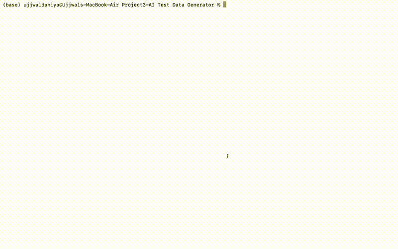

# AI-test-data-generator-with-HTML-report-and-retry-mechanism

## Demo



---

##  Test Data Categories

| Category | Description | Example |
|---|---|---|
| ✅ Positive Cases | Valid happy path data | Normal user registration |
| ❌ Negative Cases | Invalid data that should fail | Email without @ symbol |
| ⚠️ Edge Cases | Boundary and extreme values | Max length name, age = 18 |
| 🔐 Security Cases | SQL injection and XSS strings | `' OR 1=1 --` |

---

## 🛠️ Tech Stack

- **Python 3.14**
- **Groq API** (Free tier)
- **LLaMA 3.3 70B** model
- **JSON** for schema definition and output
- **HTML/CSS** for visual reporting

---

##  Setup and Installation

### 1. Clone the repository
```bash
git clone https://github.com/your-username/ai-test-data-generator.git
cd ai-test-data-generator
```

### 2. Create and activate virtual environment
```bash
python3 -m venv venv
source venv/bin/activate
```

### 3. Install dependencies
```bash
pip install -r requirements.txt
```

### 4. Set your Groq API key
Get a free API key from https://console.groq.com
```bash
export GROQ_API_KEY="your-api-key-here"
```

### 5. Add your schemas
Add any number of `.json` schema files to the `schemas/` folder.
The tool automatically picks up all schemas — no code changes needed.

### 6. Run the generator
```bash
python3 generator.py
```

### 7. View the report
```bash
open output/report.html
```

---

## 📄 Sample Schema (schemas/user_registration.json)

```json
{
  "entity": "User Registration Form",
  "fields": [
    {"name": "first_name", "type": "string", "max_length": 50},
    {"name": "last_name", "type": "string", "max_length": 50},
    {"name": "email", "type": "email"},
    {"name": "password", "type": "string", "min_length": 8},
    {"name": "age", "type": "integer", "min": 18, "max": 99},
    {"name": "phone", "type": "string", "format": "US phone number"},
    {"name": "zip_code", "type": "string", "format": "US zip code"}
  ]
}
```

---

## 🎯 Business Value

> Reduces manual test data creation time by ~80% compared to manual effort.
> Ensures security test cases (SQLi, XSS) are never missed.
> Works with any schema — drop in a new JSON file and run.

---

## 💡 Key Engineering Decisions

- **Retry mechanism** — automatically retries up to 3 times if AI returns
  malformed JSON, ensuring reliability without crashing
- **Auto folder creation** — output/ folder is created automatically if missing
- **Schema autodiscovery** — any .json file dropped in schemas/ is
  automatically processed, no code changes needed
- **Categorised output** — separate files per category makes it easy to
  plug into any test framework

---

##  Future Improvements

- [ ] Accept schema from command line argument
- [ ] Export test data directly to CSV for spreadsheet tools
- [ ] Integration with pytest to auto-run validation tests
- [ ] Support for database schemas (SQL CREATE TABLE statements)
- [ ] API endpoint to generate test data on demand

---

##  Author

Ujjwal Dahiya
Masters Student | Aspiring SDET
GitHub: github.com/ujjwal-dahiya